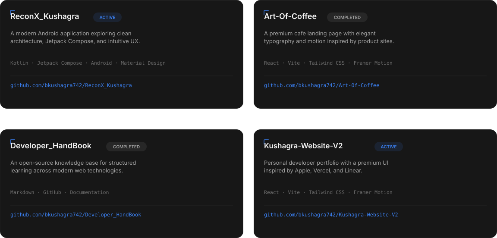

<picture>
  <source media="(prefers-color-scheme: dark)" srcset="assets/banner-dark.svg">
  <source media="(prefers-color-scheme: light)" srcset="assets/banner-light.svg">
  
</picture>

  

 

 

  

**Kushagra Singh Bisht** · Ujjain, India
[Portfolio](https://bkushagra742.qzz.io) · [LinkedIn](https://www.linkedin.com/in/bkushagra742) · [Instagram](https://www.instagram.com/bkushagra742) · [Email](mailto:bmamta742@gmail.com)

 

I'm an engineering student working across frontend development, Android, and
AI-assisted engineering — I enjoy creating clean, scalable, and impactful
digital experiences. Most of what I build starts as a rough idea in a
terminal and ends up as something people can actually use.

 

### the tools I build with

Day to day that means **React**, **Vite**, and **Tailwind CSS** on the web,
**Kotlin** and **Jetpack Compose** on Android, and **Python** for
everything AI-adjacent. My editor is VS Code, my daily driver leans on
**Kali Linux** for the freedom it gives me to configure things exactly the
way I want, and Figma is where interfaces get worked out before a single
line of code is written.

<table>
<tr>
<td valign="top" width="33%">

**Languages**
C · Python · JavaScript
Kotlin · HTML5 · CSS3

</td>
<td valign="top" width="33%">

**Frameworks**
React · Vite · Tailwind CSS

</td>
<td valign="top" width="34%">

**Tools**
Git · GitHub · VS Code
Android Studio · Figma · Kali Linux

</td>
</tr>
</table>

 

### things I've shipped

<picture>
  <source media="(prefers-color-scheme: dark)" srcset="assets/projects-dark.svg">
  <source media="(prefers-color-scheme: light)" srcset="assets/projects-light.svg">
  
</picture>

<a href="https://github.com/bkushagra742/ReconX_Kushagra">ReconX_Kushagra</a> ·
<a href="https://github.com/bkushagra742/Art-Of-Coffee">Art-Of-Coffee</a> ·
<a href="https://github.com/bkushagra742/Developer_HandBook">Developer_HandBook</a> ·
<a href="https://github.com/bkushagra742/Kushagra-Website-V2">Kushagra-Website-V2</a>

  

### how I work

GitHub is where most of that process is visible — commits over comfort,
small consistent pushes over big rewrites.

<!--
  Stats, top languages, and achievements below are generated by
  .github/workflows/metrics.yml (lowlighter/metrics) on a schedule and
  published to the `output` branch — same pattern as the snake, and
  same reason: it replaces three separate free third-party widgets
  (github-readme-stats, streak-stats, profile-trophy) that go down or
  get rate-limited on their own, with one pipeline we control.
-->

 

<!--
  Snake graph is generated by .github/workflows/snake.yml on a schedule
  and published to the `output` branch. If the branch doesn't exist yet,
  run the workflow once from the Actions tab.
-->
<picture>
  <source media="(prefers-color-scheme: dark)" srcset="https://raw.githubusercontent.com/bkushagra742/bkushagra742/output/snake-dark.svg">
  <source media="(prefers-color-scheme: light)" srcset="https://raw.githubusercontent.com/bkushagra742/bkushagra742/output/snake-light.svg">
  
</picture>

 

### recently active

<!--START_SECTION:activity-->
<!-- filled in automatically by .github/workflows/activity.yml — leave as-is -->
<!--END_SECTION:activity-->

 

### what's next

Short term, that's a solid foundation in **cybersecurity**, **computer
networks**, and **software engineering** fundamentals, alongside real
mastery of **data structures & algorithms** and more open-source
contribution. Longer term, I'm working toward a role as a software
engineer at a company building things used at scale — and toward being
the kind of engineer who's equally comfortable in system design reviews
and in the weeds of a gnarly bug.

Right now that means spending time in **DSA**, **Android development**,
**system design**, **backend development**, and **AI engineering**.

 

### let's talk

[Portfolio](https://bkushagra742.qzz.io) · [LinkedIn](https://www.linkedin.com/in/bkushagra742) · [Instagram](https://www.instagram.com/bkushagra742) · [Email](mailto:bmamta742@gmail.com)

<a href="DESIGN_SYSTEM.md">see how this profile is built →</a>

 

<picture>
  <source media="(prefers-color-scheme: dark)" srcset="assets/footer-dark.svg">
  <source media="(prefers-color-scheme: light)" srcset="assets/footer-light.svg">
  
</picture>

